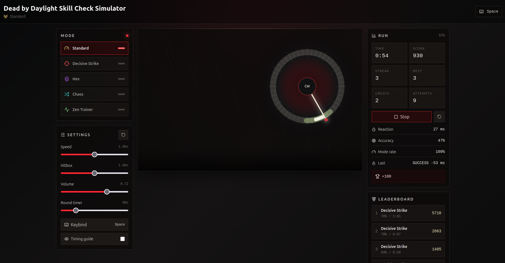

# Dead by Daylight Skill Check Simulator

A high-fidelity, performance-optimized timing simulator built with Vite, React, TypeScript, TailwindCSS, Zustand, HTML5 Canvas, and Tauri. 

This simulator is engineered specifically for ultra-low input latency. The canvas animation loop maintains absolute control over needle motion, keyboard inputs are captured via direct global hooks outside the React render lifecycle, and hit-detection scoring is calculated using high-resolution `performance.now()` microsecond timestamps.



## Technical Architecture

The codebase separates static configuration and metrics rendering from the core timing-critical systems:

*   `src/components` – React UI structures, configuration menus, and the core Canvas mounting node.
*   `src/modes` – Configuration specifications and randomized algorithmic attempt generators for each game mode.
*   `src/systems` – Main animation loops, low-latency keyboard adapters, and evaluation logic.
*   `src/store` – Persistent client and game states managed via Zustand with `localStorage` synchronization.
*   `src/audio` – Timing cue management handling standard synthetic oscillators and custom local audio buffers.
*   `src/utils` – Trigonometric mapping functions, layout helpers, and timestamp validation routines.

> **Design Paradigm:** React is utilized exclusively for static configuration menus and text-based metrics overlays. The active simulation loop draws direct raster vectors onto an HTML5 Canvas element, completely isolating visual refresh routines from React re-render cycles to prevent frame drops.

### Mechanics & Design Constraints
Skill checks spawn at randomized positions within the play area. The active hit zone is structurally generated at a calculated travel distance from the needle's starting index to ensure adequate response windows. The optional timing guide renders visual boundary indicators at success-zone edges; this feature is enforced continuously during Zen Trainer mode.

## System Features

*   **Diverse Game Modes:** Implements Standard, Decisive Strike, Hex: Ruin, Chaos, and a custom Zen Trainer mode.
*   **Microsecond Accuracy:** Utilizes a delta-time calculated `requestAnimationFrame` loop to guarantee smooth 60fps+ motion tracking.
*   **Zero-Lag Input Capture:** Keyboard-first input loops bypass React's virtual DOM engine entirely, minimizing peripheral processing overhead.
*   **Adaptive Audio Engine:** Low-latency Web Audio API architecture supports custom local sound files with a zero-dependency synthetic audio generator fallback.
*   **Advanced Analytics:** Tracks aggregate score, streaks, perfect hits, precision reaction offsets in milliseconds, and per-mode performance histories.
*   **Local Leaderboards:** Records top time-based survival thresholds with persistent local storage.
*   **Cross-Platform Desktop Binaries:** Integrated Tauri build pipelines compile lightweight, standalone native distributions for Windows and Linux environments.

## Prerequisites

*   Node.js v22 or higher
*   npm v10 or higher
*   Rust Toolchain (Stable channel, required for native desktop compilation)

### Linux Compiling Dependencies (Ubuntu/Debian)

```bash
sudo apt-get update
sudo apt-get install -y   build-essential   libgtk-3-dev   webkit2gtk-4.1-dev   libsoup-3.0-dev   libayatana-appindicator3-dev   librsvg2-dev   patchelf
```

## Installation & Deployment

### Local Development Environment

```bash
# Install package dependencies
npm install

# Launch local web development server
npm run dev
```

The web client will map to `http://127.0.0.1:1420` by default to integrate with the native webview proxy tracking layer.

### Production Web Build

```bash
# Compile and optimize frontend distribution bundles
npm run build

# Preview production bundles locally
npm run preview
```

### Desktop Binary Compilation

```bash
# Invoke the Tauri toolchain to compile a native production binary
npm run tauri build
```

Compiled installer assets and native packages are output to the `src-tauri/target/release/bundle/` directory.

## Custom Audio Configuration

Official game audio files are excluded due to licensing restrictions. To utilize custom sound profiles, place matching audio assets into the project structure prior to building or mounting the application:

*   `public/audio/skill-check-warning.ogg` – Triggered during the initial warning indicator phase.
*   `public/audio/skill-check-success.ogg` – Triggered upon landing within a standard success target zone.
*   `public/audio/skill-check-great.ogg` – Triggered upon landing within a perfect hit zone.
*   `public/audio/skill-check-fail.ogg` – Triggered on missing the target zone or upon needle timeout.

The internal audio system scans these absolute routes at initialization. If missing, the engine automatically defaults to low-level native synthesizers to prevent runtime exceptions and maintain zero-latency audio execution.

## Production Assets Overview

| Target OS | Output Format | Size | Runtime Dependencies |
| :--- | :--- | :--- | :--- |
| Windows | `.exe` (NSIS Installer) | ~1.9 MB | Utilizes pre-installed native OS WebView2 (Chromium-based) runtime. |
| Linux | `.AppImage` | ~77 MB | Bundles sandboxed WebKit2GTK and GLIBC runtimes. Requires `fuse2` on minimal environment distributions. |
